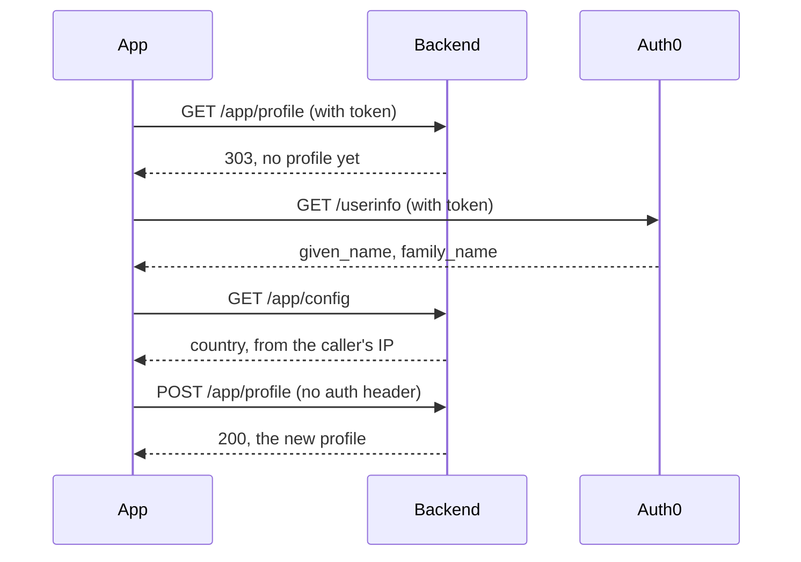
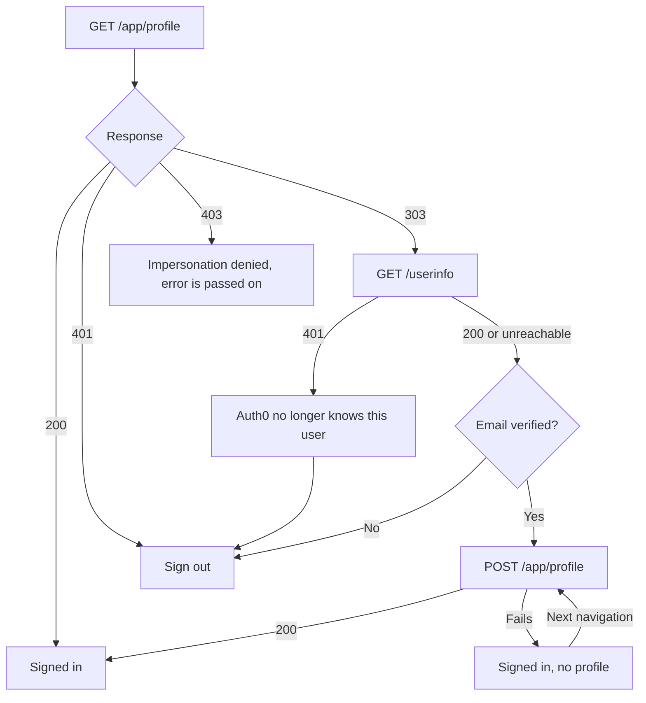
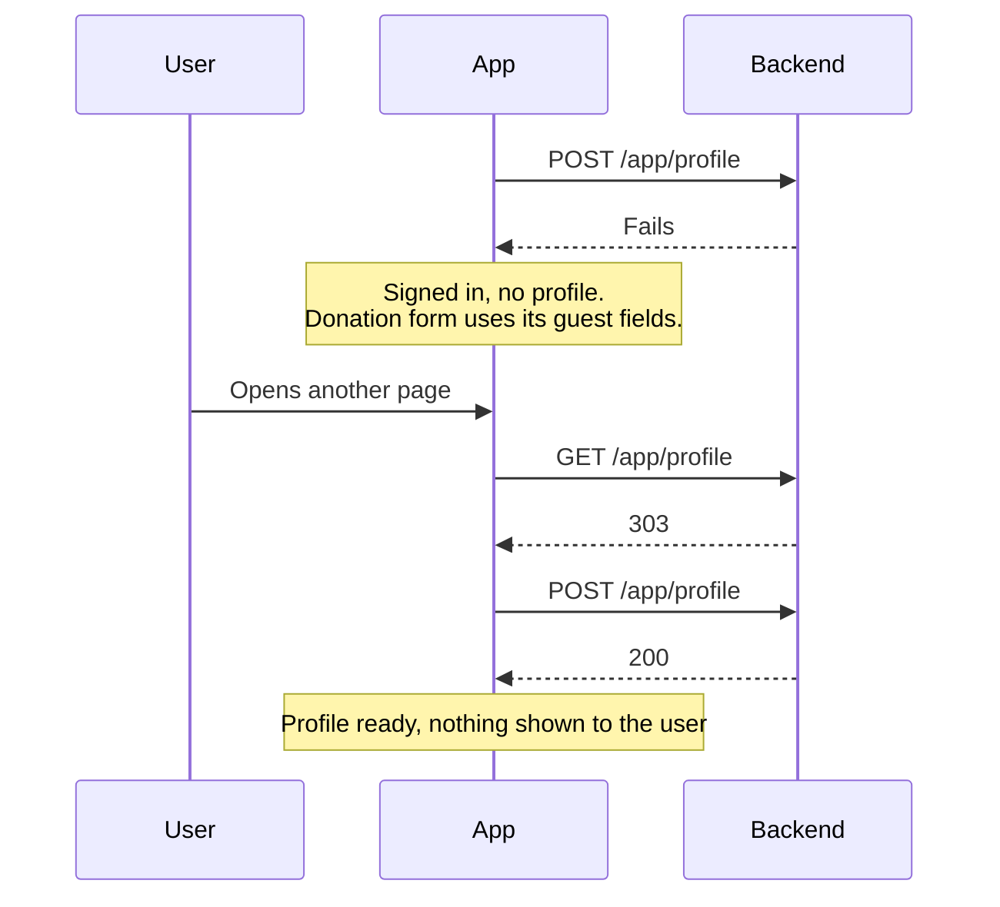

# Signup

Fundraisers has no signup form. A user signs in with Auth0, and their Backend profile is created for them from what Auth0 and the backend already know. A first sign-in and a return visit look the same to the user.

This is different from planet-webapp, which sends a new user to a `/complete-signup` form before they can continue.

## How the backend tells us

`GET /app/profile` answers **303 See Other** when the token is valid but no profile exists for its email. The body carries the decoded access token claims under `userInfo`, which is where we get the user's email.

The 303 has no `Location` header, so `fetch` reports it as a status instead of following it.

Note that the access token holds **no name claims**. Only an email. A real name has to come from Auth0's `/userinfo` endpoint.

## First sign-in



Four calls, once in a user's lifetime. A returning user makes only the first one and gets a 200.

The `POST` deliberately carries **no `Authorization` header**. The backend's firewall runs whenever that header is present, which produces the 303 again before the endpoint is reached. The token travels in the body as `oAuthAccessToken`, where the backend verifies it against Auth0.

## What we send

| Field                   | Where it comes from                                                            |
| ----------------------- | ------------------------------------------------------------------------------ |
| `firstname`, `lastname` | Auth0 `given_name` and `family_name`, then `name`, then the email address      |
| `country`               | The backend's own `/app/config`, which geolocates the caller's IP              |
| `locale`                | The language the user is browsing in                                           |
| `type`                  | Always `individual`                                                            |
| `isPrivate`, `getNews`  | `true` and `false`. No form means no consent was given, so we opt into nothing |
| `currency`              | Not sent. The backend fills it in from the first donation                      |

Names are cleaned to match what the backend accepts. Its rules differ between the two fields: a dot is allowed in a first name but not in a last name. When no surname can be worked out, we send `-`, because the backend requires a value.

## Every outcome



A 403 never means "needs signup". It means an impersonation switch was refused, either by a wrong support pin or because the target email has no profile.

A 401 from `/userinfo` means the Auth0 account was deleted. The backend verifies tokens offline, so it still accepts a token whose user is gone. Creating a profile then would bring back an erased account for as long as the token lives.

An unverified email is refused because the backend keys identity on the email address. Creating a profile from an address nobody has proven they own would hand them that account. Auth0 verifies database signups with a code before issuing a token, so this can only come from a social provider that reports the address as unverified.

The rule for all of these is the same: stay signed in only when trying again could work. Anything else signs the user out, rather than leaving them in a session that can never do anything.

## When creation fails

A failed creation is not a failed sign-in. The user stays signed in and the app tries again on the next page they open.



Only a failed creation puts the user here. The other outcomes sign them out instead, because trying again would not help.

In this state the user is signed in but has no profile. The header still shows who they are, from the Auth0 claims. The donation form falls back to its guest fields, so donating still works. Saved addresses and saved payment methods are not available.

## Testing this

### The everyday paths

1. **Returning user signs in.** One `GET /app/profile` answering 200, and no `POST`. If you see a POST, the lookup is not recognising an existing profile.
2. **First sign-in.** The four calls from the diagram above, ending in a 200. Check the created profile, not just that it worked: `firstname`, `lastname`, a `country` matching your location, and the right `locale`.
3. **Signing up with Google.** The name should come from Google, not from the email address. This is the only path that proves the `/userinfo` call is doing its job.
4. **Signing up in German.** The payload should carry `locale: "de"`, and the interface should stay German afterwards rather than switching to English.
5. **Donating straight after signing up.** The donation form should show the signed-in view, not the guest fields. Saving an address should not change the name shown on screen.
6. **Impersonating a normal user.** Should work as before, and no `POST /app/profile` should appear while impersonating.
7. **Logging out and back in.** The second sign-in should behave like any other return visit.

### The harder states to reach

**8. A user with no profile.** Sign up a fresh account through planet-webapp and stop once the email is verified, without filling in its signup form. That leaves an Auth0 account with no backend profile, which is the state every first sign-in to fundraisers starts from.

**9. A failed creation, to see the degraded state and the retry.** Devtools cannot help here: request blocking works by URL, so blocking `/app/profile` kills the lookup as well as the create. Instead make the backend reject the body. Add an unknown field to the payload in `implicit-signup.ts`, gated on a flag so you can turn it off without reloading:

```ts
const forceFailure = localStorage.getItem('forceSignupFailure') === '1';
// then spread `...(forceFailure ? { notAField: true } : {})` into the create payload
```

Unknown fields are a hard 400 on the backend, so this exercises the real error path. No profile is created, so the same account works for repeated runs. Set the flag, sign in, and you should stay signed in with the donation form showing its guest fields. Each navigation should produce exactly one more attempt, not a burst. Clear the flag and navigate once, without reloading, and the retry should complete the signup and the form should switch to the signed-in view.

Remember to remove the hook afterwards.

**10. A deleted Auth0 account.** Delete the user in Auth0 while a session is live. The backend verifies tokens offline, so it keeps accepting the token and answering 303, while `/userinfo` starts returning 401. Expect to be signed out.

**11. A denied impersonation.** Use support pin `1234` on a non-production system, which the backend treats as always wrong. Impersonating an email with no profile gives the same 403 for a different reason. Either way the staffer should stay signed in as themselves.

**12. A name derived from the email.** Sign up with an address whose local part has no separator, such as `testuser@example.com`. The profile should get that as a first name and `-` as a last name.

## Files

| File                                          | Responsible for                                                                                                                                     |
| --------------------------------------------- | --------------------------------------------------------------------------------------------------------------------------------------------------- |
| `src/lib/auth/implicit-signup.ts`             | The whole decision. Looks up the profile, creates it when missing, and reports the outcome. Also keeps two overlapping attempts down to one request |
| `src/lib/auth/auth0-identity.ts`              | Working out a name and email from the available claims, and cleaning them to what the backend accepts                                               |
| `src/lib/auth/auth0-userinfo.ts`              | Reading name claims from Auth0, and telling a deleted account apart from a call that simply did not work                                            |
| `src/lib/auth/signup-country.ts`              | Choosing a country, and falling back when the lookup gives nothing usable                                                                           |
| `src/lib/api/config-service.ts`               | The backend's `/config` call, fetched once per session                                                                                              |
| `src/lib/api/user-service.ts`                 | The profile calls, and turning the backend's responses into outcomes the app can act on                                                             |
| `src/stores/auth-store.ts`                    | Holding the session, and deciding whether a failure means signing out or carrying on without a profile                                              |
| `src/components/auth/profile-setup-retry.tsx` | Trying again on each navigation, silently                                                                                                           |

## Worth knowing

**Creating a profile is not idempotent.** A second request for the same email hits a unique index and fails as a server error, not a clean conflict. One page guards against this, but two browser tabs signing in at the same moment could each send one.

**Identity is keyed on email, not on the Auth0 user id.** So one address is one profile, however the user signed in. If their email later changes in Auth0, they look like a new user and would get a second profile.

**The name is permanent.** The backend builds the profile's display name and its URL slug at creation, and the slug never changes.

## Known gaps

- [#327](https://github.com/Plant-for-the-Planet-org/fundraisers/issues/327): the backend answers 303 on any authenticated endpoint for a user with no profile, so pages like the dashboard fail in confusing ways while a profile is missing.
- [#328](https://github.com/Plant-for-the-Planet-org/fundraisers/issues/328): a signed-in user with no saved address cannot complete a payment and sees no error. Every new user starts without an address.
- [#329](https://github.com/Plant-for-the-Planet-org/fundraisers/issues/329): Auth0 now verifies signups with a code rather than an emailed link, so the `/verify-email` route and the `email_not_verified` handling behind it may be dead. The unverified email guard here stays either way, since it also covers social logins.
